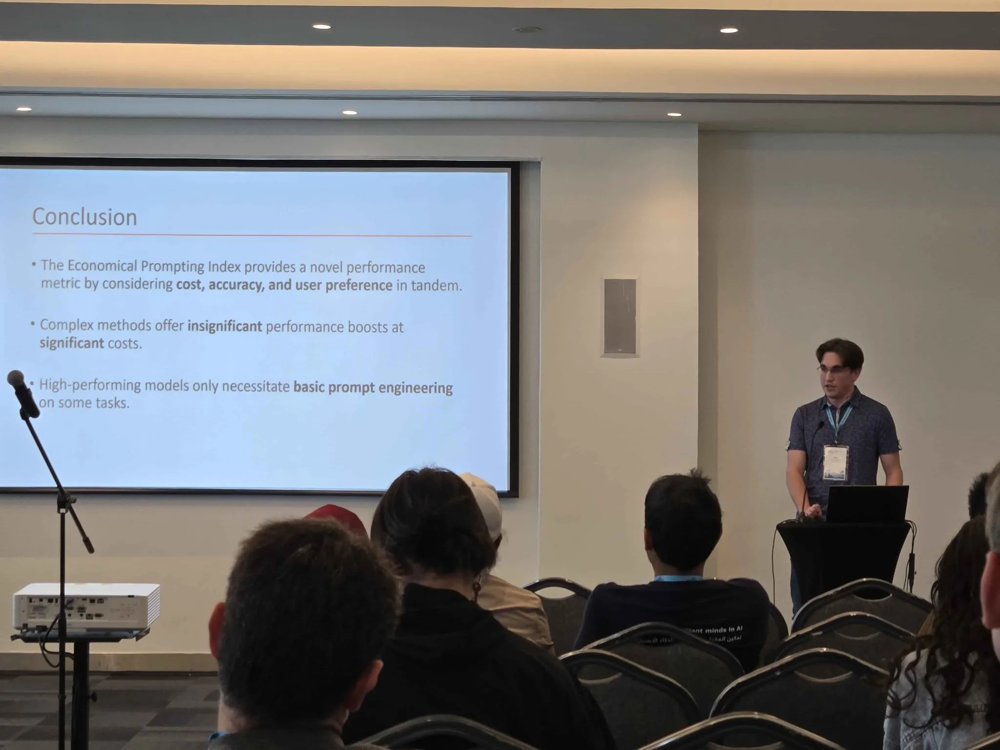
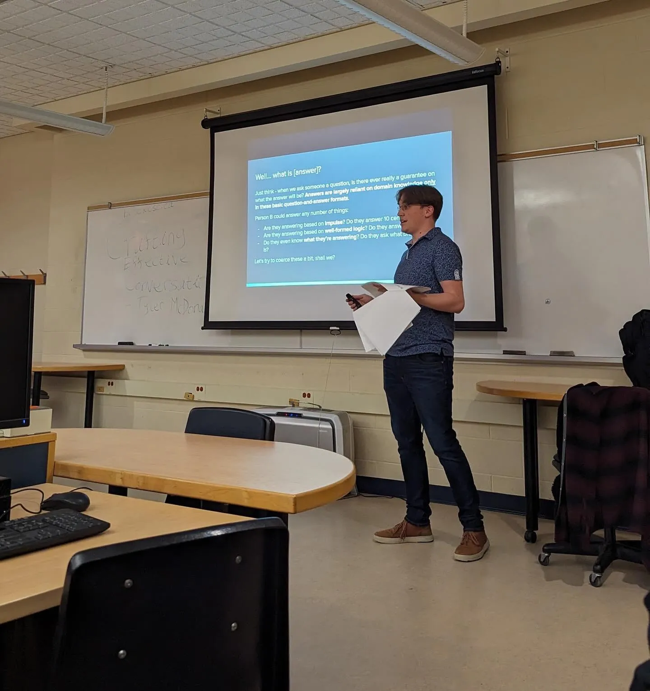
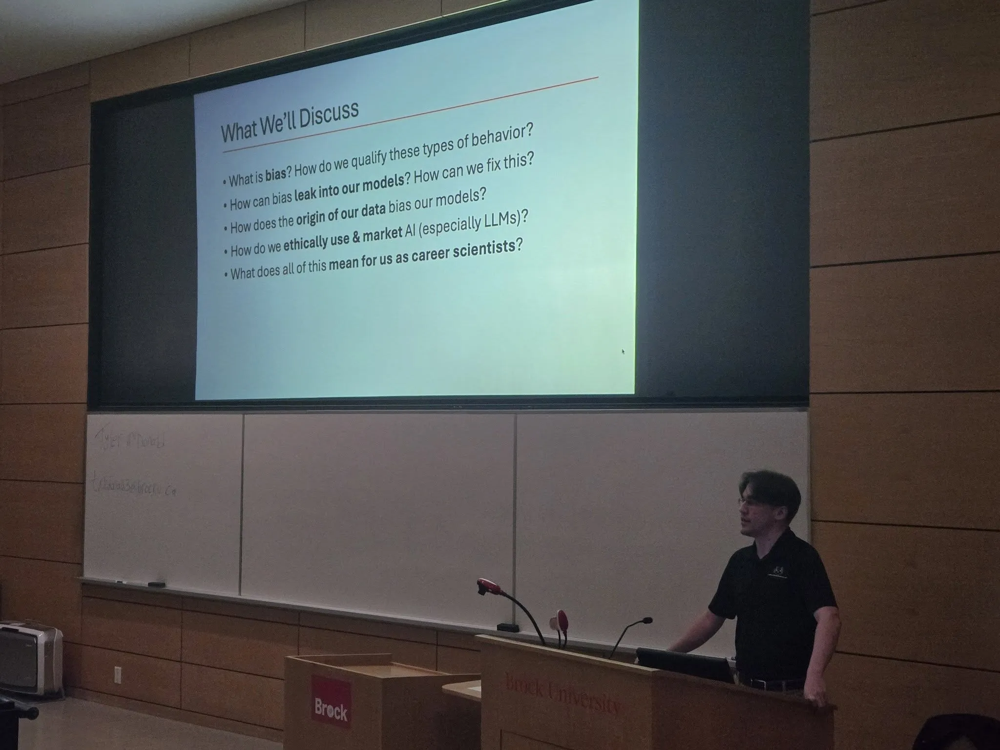

Hello! I just realized I never properly introduced myself beyond a blurb at the end of a few posts, so I figured I should actually make the About section work and add a post about myself.

## Who’s the mysterious masked man?

I’m the pensive, human-condition-obsessed writer who dabbles in having a job on the side — seeing as that’s a mouthful, though, my name is Tyler and I’m from the beautiful country of Canada. I was born and raised in Canada, and I’ve called a few different cities home since 2003. I have the privilege of living in the often-idyllic Niagara region, just shy of the Niagara-Buffalo border, where I’ve happily lived my quiet, academic life since 2021.

As far as the obligatory boring bits go, I’m currently working towards my Master of Computer Science degree at Brock University with a specialty in applied Natural Language Processing. Through my thesis, I ask several critical questions:

- Given the global “arms race” of building and deploying LLMs, there has been a wave of small consumer models designed in countries underrepresented by the origin of typical data. How, in turn, may these models reflect biases apparent in their locales? If we merge these models, what happens to the bias — and do we get a strong multilingual model as a result?
- Our community is at a relative standstill when it comes to benchmarking new innovations; we rely on the same tried and true datasets even after we know that these datasets have fully saturated into new models. How, then, can we develop datasets that are novel, evaluate critical competencies in isolation, and behave in such a way that we can pick apart the faults or strengths of the core abilities of these models?
- NLP research is well and good, but only when “applied” means “reproducible.” For example, new prompt engineering methods are great for state-of-the-art performance, but are they accessible and fair to consumers to run? Through these questions, can we develop metrics of efficacy that reflect the cost required to evoke such critical performance on some tasks?

Aside from my work as a researcher, I am also a tutor, workshop facilitator, guest lecturer, teaching assistant, mentor, and ambassador for Brock. I absolutely love my school and I’m so proud to be a part of such a tight-knit community.

I promise I also have other hobbies outside of school! I have a few things I enjoy doing:

- Obviously, I like to pretend I can write! In all seriousness, writing is a cathartic outlet for me, and even if no one reads what I write on any given day, I always feel much better getting my thoughts out on paper. Writing has carried me out of some of my worst slumps, so I hope it helps you at some point too!
- In the past, I at least *was* a musician — I’m still actively trying to break back into playing instruments as a hobby that’s not related to my work. I’ve played the drums, marimba, and clarinet, and I want to learn the piano!
- I love my walks! Walks are key for me when it comes to deciphering whatever problem I may be going through at some present moment, and even if it’s a small lap around the vicinity of my house, it always manages to help me somehow.
- Volunteering is another passion of mine — I derive great joy from seeing others succeed, and if I wasn’t so committed to becoming a professor, I swear I’d be a life coach. There’s something so fulfilling about being able to freely give your time in the pursuit of someone else’s happiness, and I really love mentoring and aiding those who find themselves in a bit of a pickle especially.

## Why write in the first place?

Short answer? It’s cathartic, and the pen and paper method has honestly saved my life a number of times. The long answer has a bit of lore behind it.

When I was in high school, I found myself grappling with a lot of really tricky emotions that I could never wrap my head around. I wasn’t exactly a big talker, so a lot of my time was spent (quite horribly) brooding and wishing things would fix themselves. I also happened to be in a bit of a movie buff stage at the same time, and a few movies I’d watched taught me the importance of introspection.

When I hit university, smack in the middle of lockdown, I had even less people to talk to — as a result, I turned to one of the things I excelled at during high school: writing. I started awkwardly and with baby steps, as I encourage you all to do, but I deliberately started by journaling as opposed to diving into creative writing. Getting your thoughts out through some common theme is really helpful for contextualizing your life, and provides a written record of your ups and downs in case you ever find yourself needing your own advice.

From there, I branched out into writing about things other than me that I really enjoyed, which is how I started writing film, TV, and game reviews. These were more a break from the norm for me and just gave me a spot to talk about things I like without flooding the DMs of my friends who were wholly uninterested. I finally started to branch out into poetry relatively recently, hopefully as a gateway drug to becoming a creative writer. It’s always been a long-term goal of mine to write something like a play or manuscript, and maybe I’ll get back to that goal in the future.

In essence, and an equally important takeaway, I write because I need an outlet, and that outlet has thankfully turned into something enjoyable. Writing is my job through being a researcher, yes, but creative writing provides a necessary break from the monotony of work, school, or whatever else I may be going through.

## What worldly advice do you have?

I always start all my conversations about life like this: I don’t provide solutions, I provide encouragements. That being said, here’s a few of my personal favorites that I’ve described *ad nauseam* over my years as an “adult”:

### Live life authentically.

You are inherently an iceberg of things you do and don’t want to show people. Icebergs have a surface level that can be marveled at, appreciated, and sought after as beautiful or inspiring. With all of this perfect information at your disposal about yourself and others, why would you go through the effort of building *another* iceberg? You only have one shot at what you do here on Earth, so if it means an awkward date or a slow-burn friendship, accept and appreciate those moments of slowly revealing your ambitions and desires to those around you. It starts small, like not dressing differently to posture towards someone or not changing your vernacular because someone thinks you sound weird; be your authentic self, because people want to connect with other people, not facades.

### Yearn for the little things.

The leaves on your tree just turned orange, the summer heat is everything you’ve been waiting for, and the way a snowflake hits your nose so softly made you giggle — always find joy in those things. We spend so much of our lives looking forward 5 or 10 years in a desperate plea to get somewhere that we ignore the wild journey we take. It’s not always peaches and cream, and life inherently sucks sometimes, but there’s nothing better than being able to confidently say you fought a good fight and finished all the work you set out to accomplish. Along the way, stop and smell those roses, and maybe pick a few for your eventual garden.

### Love even when love stabs you in the back.

Self-confidence permitting, there are very few things on this planet more impactful than genuine love. Love isn’t always a partner or spouse; we find love in pets, in family, in hobbies, in seasons, in clothing, in games, in movies, and in so many other things. Love with your entire heart, always, because you’re doing yourself a disservice by leading with your mind. You will make mistakes, you will mess up and find the wrong people, and you absolutely will replay embarrassing moments in your life down the road — but, just for a second, remember that you hold such a powerful and divine gift of being able to replay those moments.

## Can we do a rapid-fire round about you?

Absolutely!

**Favorite food?** I am an absolute sucker for anything spicy — one of my favorite meals is a good homecooked chicken tikka masala.

**Favorite movie?** Hard pressed to say — *La La Land* comes to mind, along with some animated films like *Paprika*, *Ride Your Wave*, or *Weathering With You*.

**Favorite book?** This likely changes with the seasons, but I’m a massive fan of the *Spice & Wolf* light novel series. I’m also a big self-help book guy, so *Thinking Fast and Slow* or *Stolen Focus* are some great picks.

**Favorite moment?** I have far too many to list just one! Chief among mine are the first time I gave a research presentation at an international conference, the final run of the one-shot play that I sound designed for in tenth grade, or all the times I tossed a baseball around with my dad.

**Favorite country?** Thailand was *gorgeous*, and the people equally so. Of course, bound to change soon!

**Favorite song?** *North* by Sleeping At Last, *The Hymn of Acxiom* by Vienna Teng, or *Where The Wild Things Are* by Luke Combs!

**Biggest regret?** Breaking out of my shell too late in life — I was notoriously complacent until the end of university, so I robbed myself of so many life experiences.

**Coffee or tea?** Black coffee all the way!

**Guilty pleasure?** Buffalo chicken chip dip, a warm blanket, and my hundredth rewatch of my favorite movie!

**Hidden talent?** I’m weirdly good at doing impressions of my friends! On the more sane side of things, I have a typing speed of 120 words per minute, which I think counts?

**Dogs or cats?** Sorry, I love my Goldens, but a good cat is an academic’s best friend!

## I want to learn more about you — how can I?

I’m an open book for the most part! Send an email to tmcdonald3 with the suffix brocku dot ca, and I’m more than happy to entertain an idea, a prompt, or just a question.

Obligatory notes:

- I am not your therapist, but I’m always happy to provide a listening ear if something you read here really resonated with you.
- I am a graduate student, not a professor, and as such cannot accept requests for students to join a lab that I do not have.
- I am not seeking internships or cold-call outreaches for employment. These will be deleted if received.

Thanks for taking a little time to learn more about me!