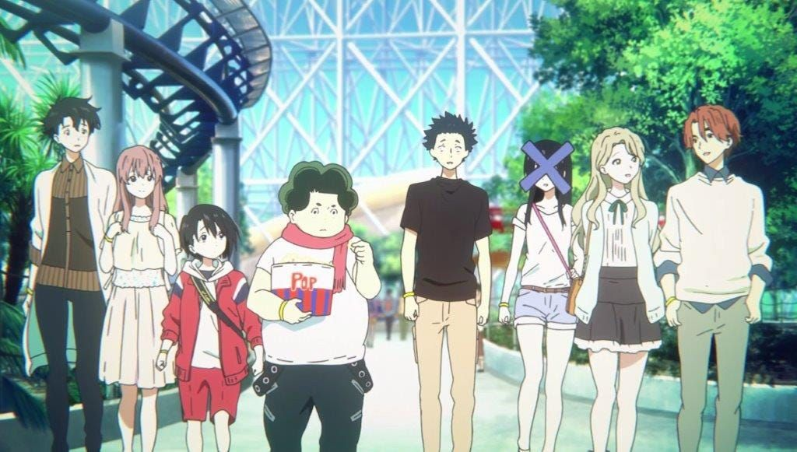
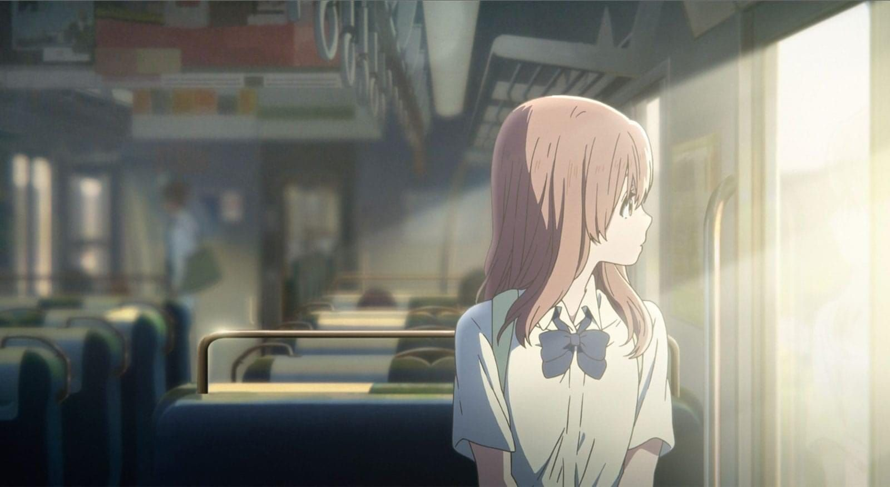
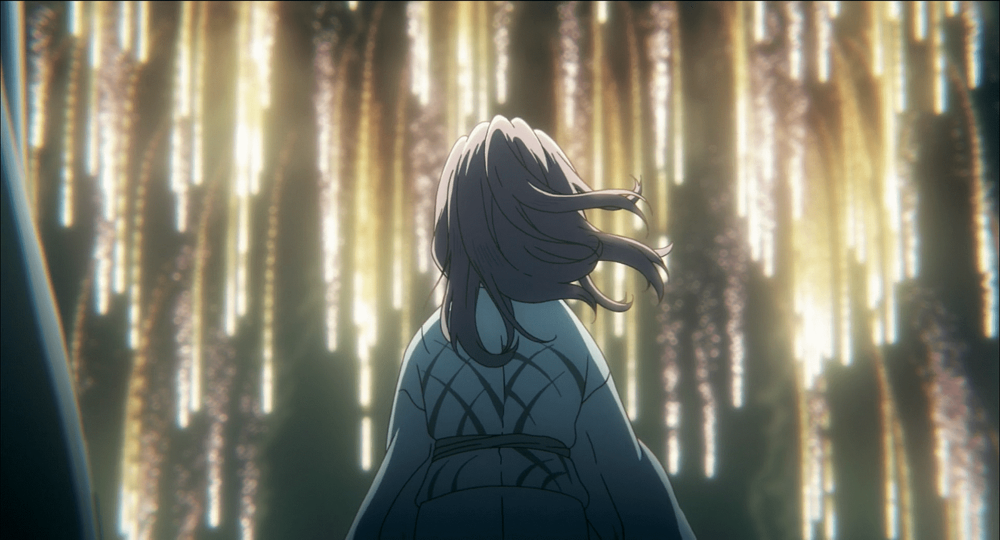
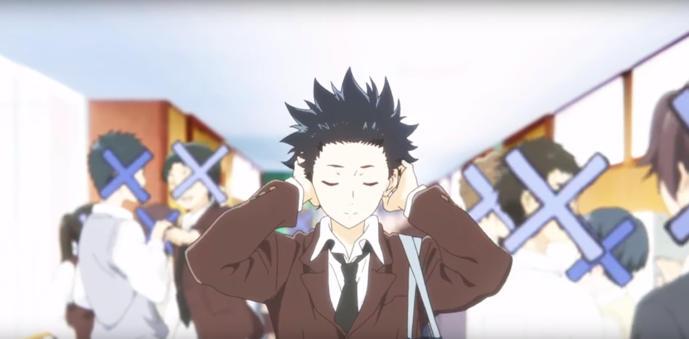

+++
author = "Tyler McDonald"
title = "Living Again - A Review of 'A Silent Voice'"
date = "2022-01-15"
description = "This film may mistakenly present itself as a cliche romance, but you’ll soon witness firsthand the trials and tribulations that come with overcoming overwhelming social anxiety, social reclusion and depression."
tags = [
    "anime",
    "review"
]
categories = [
    "reviews",
]
image = "livingagain.jpg"
+++
**WARNING: Major spoilers for *A Silent Voice* ahead!**

*Author’s Note: I make frequent use of the term “deaf” in relation to general deafness, and make use of the lowercase d convention; as Shoko is but a movie character, and this is not a non-fictional work, I have chosen this convention to better suit the needs of this review and the context of the film. Additionally, I briefly reference the English voice actress, Lexi Cowden, with lowercase d convention as I am not aware of Lexi’s personal circumstances or viewpoints at time of writing.If any language I use here is inappropriate, or could be changed to better suit the masses, please privately contact me at tm21cy@outlook.com. I greatly appreciate it, and I am always open to learn!*

I tend to stay away from the realm of anime movies — the linear flow and equidistant stopping points of a TV show style allows me to better focus on gathering points of interest for reviews — but *A Silent Voice* has taught me to ignore that narrative for just a little longer. It definitely takes a toll on you to go through multiple iterations of happiness and sadness, anger and dismay, hopelessness and brilliance throughout the span of a movie, but this time was worth it.

*A Silent Voice* follows Shoya Ishida, a high schooler who, during his younger years, was often a bully to a deaf transfer student, Shoko Nishimiya. Shoya fell into the trap of rebound bullying early on; often finding himself in a situation where he felt uncomfortable or disliked, he would fall back on the safeguard of bullying as a means to channel his negativity. After ruthlessly bullying Shoko to the extent that she had to transfer schools — and after his mother made amends to the tune of 8 replacement hearing aids — Shoya falls into a deep, reclusive depression. After being socially ostracized, he contemplated death and nearly materialized it on a few occasions, until realizing his recipe for internal harmony was to remedy the past and make up for lost time with Shoko. This film may mistakenly present itself as a cliche romance, but you’ll soon witness firsthand the trials and tribulations that come with overcoming overwhelming social anxiety, social reclusion and depression.

**My Score: 10/10**

I am a *very* picky critic, giving out 10s only to films I know I’m going to make a conscious effort to rewatch over and over again. *A Silent Voice* is a movie I don’t want to rewatch, but instead, re-experience. With a masterful blend of unique artwork, sound design that makes my inner tech geek shiver, and characters who aren’t rushed to develop in the two hour window of the movie, *A Silent Voice* is to rightfully go down in history as one of the best, discomfort inducing movies of all time.

## Characters - 10/10
A Silent Voice features two predominant characters in Shoya and Shoko, but the real message of the movie is made up of the supplementary characters — Shoko’s younger sister, Yuzuru; Shoya’s right hand man, Nagatsuka; the school troupe of Miyoko, Miki, Naoka, et cetera. This movie develops so many notable supplementary characters, in fact, that to list them off here would be incredibly exhausting. A Silent Voice focuses a large majority of its efforts on developing the human in the movie, instead of focusing purely on the intricacies of the plot; while this sounds like a recipe for disaster, it works out quite well when the plot is so simple that it becomes complicated. Because of the lack of fulfilled romance — and romance in general occupying all of five minutes of the movie — the characters needn’t follow a predefined trope or goal for end-stage development, which allows for a sort of free reign in development overall. No two characters are intended for each other, which plays well into Shoya’s perspective of not having many friends to begin with, as in being perfectly content with a friend group in general, his friends seem to mesh together like a melting pot of characteristics. Shoko is also written extremely well for a deaf character; as we all know, representation of disabilities is incredibly flawed by those who don’t live with these same circumstances. However, this movie not only nails the perspective without needlessly infringing, but also hired a deaf voice actress to voice Shoko’s English dub! Shoko’s perspective, for reasons I will delve into later, is also greatly enhanced beyond mute audio or ringing, and further humanizes her circumstances to a respectable level. Shoko is not written as a liability to the plot or the characters, and is instead uplifted and encouraged to act as she ought to: a member of their social circle. With all these points in mind, A Silent Voice makes great use of creative writing to define relatable characters who aren’t there to fit a trope, and as such are wonderful to listen to.

## Plot - 9/10
A Silent Voice has an amazing story, rich with simple scenes that play to your emotions instead of your cognition, and force you to open yourself up emotionally to fully grasp the entire meaning of the story. Scenes are very uncomplicated in the movie, and the definition of what a scene is supposed to entail is defined nearly from the get-go. The characters are also designed in a way that prevents them from being abrasive to any of these scenes, so they tend to mesh quite well with the plot no matter the underlying subplot(s). I found myself emotionally moved by the simple details in the plot — train rides that could be turned into gifs because they’re so plain and simple, or fireworks displays that are there simply to be fireworks displays. The only grievance I have with the plot, and a small one at that, is that it can move a tad bit too fast at points, with some uncomfortable and awkward time-skips between critical periods of time, intersected by brief memories. The movie starts in the time period in which it ends, flashing back to various moments throughout Shoya’s school life. While I encourage this analepsis-focused plot, it needs to be clearer cut at points to avoid confusion during emotionally charged scenes. Once or twice during the movie, I was in the middle of a panic episode about the next major plot point, only to harshly enter a state of “wait, what?” which definitely kills the vibe of the scene. The major scene of Shoko’s failed suicide and Shoya’s coma, while originally implied to be cheesy and traditional, is actually perfect for the plot and just made me more interested. I will say, however, that Shoya waking up from a coma and running into the street in the span of (presumably) under ten minutes was very jarring in its surrealism, but hey, the sacrifices for a good scene right? Overall, this story was incredibly engaging, kept me on my toes for the better portion of it all, and ended in such a way that I felt adequately satisfied with my two hour commitment.

## Artwork & Sound Design - 10/10
Oh my, the artwork in this movie is so profoundly unique it left me begging for more! Every scene was animated with care, and the design choices in the X marks over peoples’ faces was crucial to understand the inner workings of Shoya. The art style is unlike most other anime one-shots or movies I’ve watched, and I really enjoyed the perfect balance between landscape-focused and human-focused design. Everything about these characters is realistically animated, and some of the more emotionally charged scenes are made just that tad bit better by nested details. The sound design played beautifully into this narrative as well, encouraging the viewer to prepare emotionally for a scene without them even knowing it. Shoko’s perception was captured in such a way where no disrespect could be communicated, at least to me, and every design element was so meticulously crafted that it felt as if you were watching the story play out as if you were walking down the street when it happened in front of you. Simple cues like water droplets, trees, et cetera are handled very well, but the real beauty is in the dissonances, subtle clashes and major/minor flips throughout the entire movie, worked beautifully into the music and harmoniously integrated into each scene. With unique methods such as stuffing a microphone into a piano for a muffled music effect (source TBA), the foley team did incredible work putting together a rich and engaging soundscape for any and all to enjoy. This meshing of sound and art shows us the importance of the two working in harmony, and challenges us to critically evaluate each use-case of both in every other movie we watch.

## Personal Connection
> “You probably didn’t know this, but I don’t really fit in at school. It’s cause I have trouble looking people in the eye, so it’s easier for me to just stare at the floor all the time.”
>

I deeply resonated on a personal level with the struggles Shoya went through, minus them being brought on by incessantly bullying someone. For a while, social reclusion was my outlet for my issues, and having been bullied in elementary school, I felt this aspect of Shoya’s character was so well done due to its careful addressing throughout the late stage of the movie. Characters do not “force him out of his shell”, they work with his limitations and he naturally overcomes them in the same way that I can say I have personally. I still to this day can’t look most people in the eye for reasons related to Shoya: when I was stressed, I turned to the books, which made me a social recluse. However, in witnessing Shoya’s development being so carefully handled, the writers have actually inspired me to reevaluate my own mental limitations in a motivating frame of reference. I am incredibly thankful to have watched a movie that inspired me this way, as they are very few and very far between.

*A Silent Voice* also forced the uncomfortable within me to emerge. I was forced to confront the fact that a deaf character makes my relation harder to them from time to time because of my own mental roadblocks, which I have lifted in favor of an activist approach to my lifestyle. *A Silent Voice* also helped me address my own personal, ingrained discomforts in a way that was healthy and selfless for me and those around me, and encouraged me to move past these discomforts in a meaningful manner and not because “I had to”. I also had to confront previously sensitive issues, like death and suicide, which I have almost fallen victim to and have witnessed friends suffer from their icy grasps over the years. This movie doesn’t try to ease that pain either, which is good: characters continue to see Shoya as “the guy who nearly killed himself” and not some sort of twisted hero, which is very uncomfortable but very respectful to the social climate surrounding the issue, however incorrect it may be. It shows us that most of the time, internal acceptance comes far prior to social acceptance, and that reaching internal resolve is all that matters sometimes.

All in all, if you want an emotional rollercoaster of a watch, definitely invest an evening into *A Silent Voice*. It will force you to encounter some deep demons in your subconscious, and will likely influence a tear or two, but it all feels so, so rewarding after the fact. With acclaim from the director of *Your Name*, you know it’s bound to be a good watch!